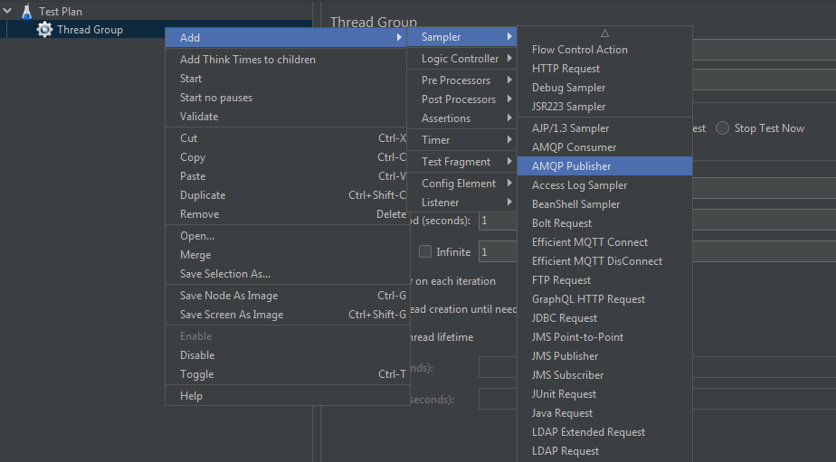

# JMeter AMQP Plugin

[](https://github.com/aliesbelik/jmeter-amqp-plugin/actions/workflows/maven.yml)
[](https://github.com/aliesbelik/jmeter-amqp-plugin/releases/latest)

A [JMeter](http://jmeter.apache.org/) plugin to publish & consume messages from [RabbitMQ](http://www.rabbitmq.com/)
or any [AMQP](http://www.amqp.org/) message broker.

## Requirements

- Requires JDK 8+.
- Compatible with versions up to **4.12.0** of [com.rabbitmq:amqp-client](https://github.com/rabbitmq/rabbitmq-java-client).

## Installation

1. Download the [latest release](https://github.com/aliesbelik/jmeter-amqp-plugin/releases/latest) or
[build your own](#build) from the source code.
2. Put `jmeter-amqp-plugin-VERSION-jar-with-dependencies.jar` into `$JMETER_HOME/lib/ext` directory.\
It contains the necessary AMQP client dependency, no other jars are required.
3. Restart JMeter GUI.

In case if you need the plugin without the AMQP client included, you can use the `jmeter-amqp-plugin-VERSION.jar`,
but you have to ensure that the [RabbitMQ client library](https://www.rabbitmq.com/java-client.html) -
`amqp-client-VERSION.jar` - is installed in `$JMETER_HOME/lib` directory.

## Usage

This plugin includes 2 samplers:

- [**AMQP Publisher**](#amqp-publisher)
- [**AMQP Consumer**](#amqp-consumer)

Both samplers can be found in the Add -> Sampler list shown as below:



### AMQP Publisher


### AMQP Consumer


A pre-configured example scenario can be found in the [examples](docs/examples) directory.

## Build

### Build requirements

In order to build JMeter AMQP plugin from source, you will need:

- [Java 8](https://www.oracle.com/downloads/)
- [Apache Maven 3](https://maven.apache.org/)

Build dependencies are managed by Maven.\
Jars should automatically be downloaded by Maven as part of the build process.

In addition, you'll need to copy or symlink the following from `$JMETER_HOME/lib/ext` directory:

- ApacheJMeter_core.jar

### Build from source

To build, just execute:

```
mvn clean package
```

This will create 2 jars in `/target` directory, the original jar and the jar with all the dependencies within
(this is the one you need):

```
target/jmeter-amqp-plugin-VERSION.jar
target/jmeter-amqp-plugin-VERSION-jar-with-dependencies.jar
```

To install, execute:

```
cp target/jmeter-amqp-plugin-VERSION-jar-with-dependencies.jar $JMETER_HOME/lib/ext
```

## Acknowledgements

Thanks to

 - [jlavallee](https://github.com/jlavallee) (Jeff Lavallee), who created [original plugin](https://github.com/jlavallee/JMeter-Rabbit-AMQP);
 - [polarnik](https://github.com/polarnik) (Viacheslav Smirnov), who spent time and efforts to create
[comparison](https://github.com/polarnik/JMeter-Rabbit-AMQP-info) of the forks with valuable changes;
 - for the features & enhancements implemented in their forks:
   - [gregLibert](https://github.com/gregLibert/JMeter-Rabbit-AMQP) (Gregory Libert),
   - [gybandi](https://github.com/gybandi/JMeter-Rabbit-AMQP) (Gyuro Andras),
   - [looseend](https://github.com/looseend/JMeter-Rabbit-AMQP) (John Singleton),
   - [sergiogouveia](https://github.com/sergiogouveia/JMeter-Rabbit-AMQP) (Sergio Gouveia),
   - [wojtek-oledzki](https://github.com/voytek-solutions/JMeter-Rabbit-AMQP) (Wojtek Oledzki),
   - [zeph1rus](https://github.com/zeph1rus/JMeter-Rabbit-AMQP);
 - all the [contributors](https://github.com/jlavallee/JMeter-Rabbit-AMQP/graphs/contributors) to original project.

## Contributing

Contributions are welcome.
